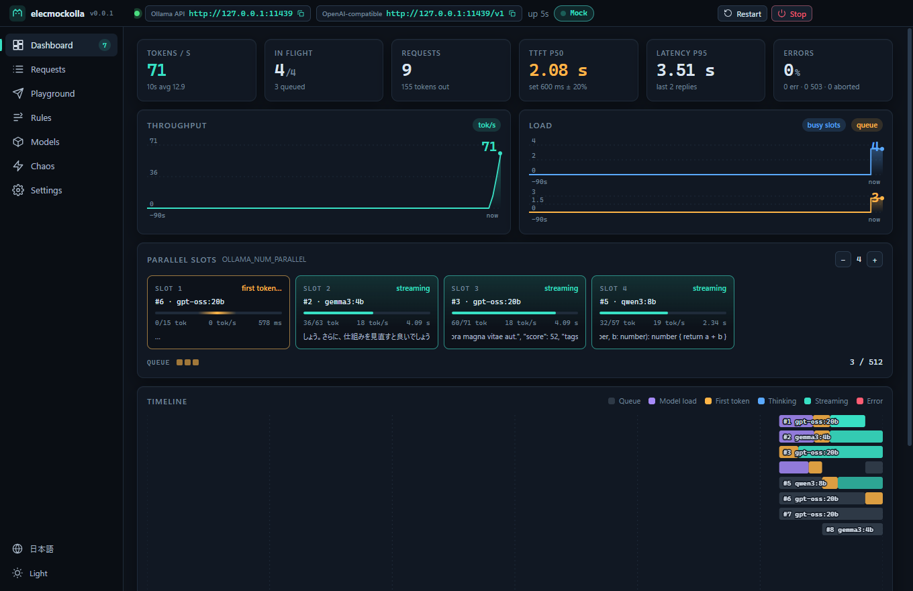
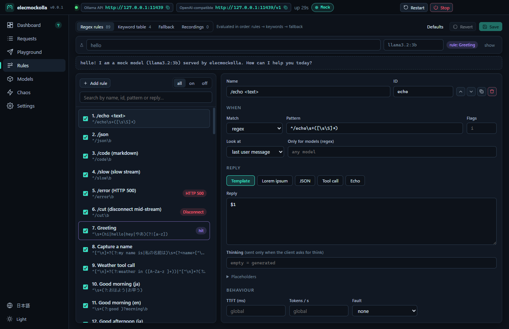
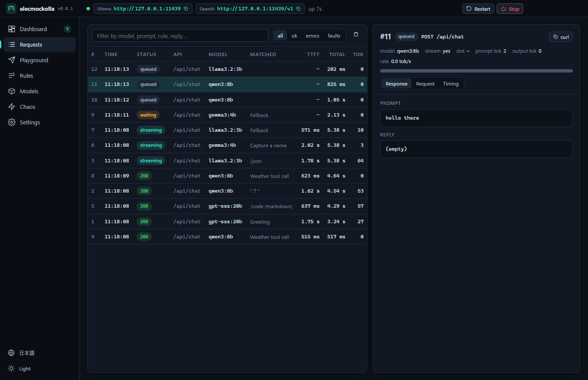

[](LICENSE)
[](https://zenn.dev/kurouna)
[](https://x.com/elecxzy)


# elecmockolla

A mock [Ollama](https://ollama.com) server with a live dashboard. Point your app at it instead
of a real model, and get instant, scripted, reproducible replies — for tests, for debugging,
and for demo videos and screenshots that do not depend on a GPU.

Ollama 互換のダミーサーバーと、その動きを見て操作できる管理画面。本物の LLM を待たずに、
アプリのテスト・動作確認・デモ動画やスクリーンショットの撮影ができます。

<p align="center">
  
</p>

> **v0.0.1 — first version.** Developed on Windows. The server and CLI are plain Node and
> should run anywhere; the app has not been tried on macOS or Linux yet.

## Quick start

```bash
npm install
npm start
```

That is all: the app opens, writes `.env` and `rules.json` next to `package.json` if they do
not exist, and starts the mock on `http://127.0.0.1:11434`. Point your app there (or set
`OLLAMA_HOST`). If the real Ollama already uses 11434, the app says so — change the port in
**Settings**.

Without the app:

```bash
npm run serve                     # same server, same .env, logs every request
npm run serve -- --port 11435 --preset demo
npm run cli -- init               # write .env and rules.json
npm run cli -- --help
```

## What makes it different

Other mock servers ([fake-ollama](https://github.com/spoonnotfound/fake-ollama),
[llmock/aimock](https://github.com/CopilotKit/llmock),
[ollamock](https://pkg.go.dev/github.com/thushan/olla/test/cmd/ollamock), MockServer) are
headless. elecmockolla adds what you want while building an app that talks to Ollama:

- **See what your app sends.** Every request is recorded: the exact body, which rule answered,
  queue / load / first-token / streaming time, and a *copy as curl* button.
- **Watch it run.** Tokens per second, busy slots and queue over time, a live card per parallel
  slot, and a waterfall of the last 30 seconds — animated at 60 fps, dark and light.
- **Behaves like Ollama under load.** `OLLAMA_NUM_PARALLEL`-style slots and an
  `OLLAMA_MAX_QUEUE`-style queue: extra requests wait, and past the queue they get
  `503 server busy`. Cold models pay a load time and show up in `/api/ps` until `keep_alive`
  expires.
- **Replies you design, without code.** Regex rules with capture groups (`$1`, `$<name>`), a
  keyword table for the quick cases (`？` → a question reply), lorem ipsum in English or
  Japanese, JSON templates, tool calls and thinking — edited in the app and tested live before
  you save.
- **Chaos on a button.** HTTP 500, a stream cut halfway, a request that never answers, or a
  broken JSON line — once, five times, or at random with a probability. A load generator fills
  the dashboard or the queue.
- **Reproducible.** A fixed seed gives the same reply to the same prompt, every run. Speed
  presets from *Instant* (for CI) to *Slow CPU* (for spinners and timeouts), and *Demo*.
- **Or put the real Ollama behind it.** Proxy mode forwards everything to a real Ollama and
  shows the real traffic on the same dashboard; mixed mode answers from the rules first and
  sends the rest to Ollama.

## API coverage

| Ollama | OpenAI-compatible | Control (`/_mock/*`) |
|---|---|---|
| `POST /api/chat`, `/api/generate` (stream or not, `think`, `format`, `tools`, `num_predict`, `keep_alive`, `seed`) | `POST /v1/chat/completions` (SSE, `stream_options.include_usage`, `response_format`, tool calls) | `GET status`, `requests`, `events` (SSE) |
| `POST /api/embed`, `/api/embeddings` | `POST /v1/completions` | `GET`/`PUT rules` |
| `GET /api/tags`, `/api/ps`, `/api/version`, `POST /api/show` | `POST /v1/embeddings` (float or base64) | `GET`/`PATCH config` |
| `POST /api/pull` (simulated progress), `/api/create`, `/api/copy`, `DELETE /api/delete` | `GET /v1/models`, `/v1/models/:id` | `POST fault`, `test`, `reset` |

Tested with the official [`ollama`](https://www.npmjs.com/package/ollama) and
[`openai`](https://www.npmjs.com/package/openai) clients. Embeddings are deterministic and
similar texts get similar vectors, so retrieval code can be tested too.

## Replies

Every prompt goes through three stages; the first that matches answers.

1. **Rules** — `regex`, `contains` or `always`, on the last user message, the whole
   conversation or the system prompt, optionally only for some models. Each rule chooses a reply
   kind (template, lorem, JSON, tool call, echo), and may override the speed or force a fault.
2. **Keyword table** — "if the prompt contains X, reply Y".
3. **Fallback** — lorem ipsum by default, in Japanese when the prompt is Japanese.

Templates understand `$1`…`$99`, `$<name>`, `$&`, and `{{prompt}}`, `{{model}}`,
`{{lorem:N}}`, `{{lorem-ja:N}}`, `{{int:1-100}}`, `{{pick:a|b|c}}`, `{{uuid}}`, `{{date}}`,
`{{time}}`, `{{now}}`, `{{n}}`. When the client asks for `format: "json"` or a JSON schema and
the rule replied with text, a valid document is produced (fake values that follow the schema).

The default `rules.json` starts with one slash command per feature: `/json`, `/code`,
`/echo …`, `/slow`, `/error`, `/cut`. Then come replies for the conversations an AI chat
usually has, in Japanese and English: greetings by the time of day (おはよう, good night…),
"I'm home", fortune-telling and horoscopes (`占って`, `Leo horoscope`), "what is …", "how do I …", comparisons (as a
table), code (TypeScript or Python), fixing an error, summaries, translation, rewriting, emails,
recommendations, pros and cons, ideas, poems, stories, jokes, recipes, the date and time, "who
are you", thanks, goodbyes — and a refusal, to test how your app shows one. Try `hello`,
`What is Kubernetes?`, `ReactとVueの違いは？`, `東京の天気は？`, `Tell me a joke`. These rules read
only the first line of the prompt.

At the end of the list, **off by default**, are rules for the ELEC system pane of
[elecdex](https://github.com/kurouna/elecdex): each of the three units (LOGOS, ETHOS, PATHOS)
gets a statement in its own voice and in the motion's language, ending with the `VERDICT:` and
`CONFIDENCE:` lines elecdex reads. Each unit leans its own way (`{{pick:…}}` chooses the verdict,
`{{int:…}}` the confidence), so the council does not always agree. Turn them on in **Rules**.

<p align="center">
  
  
</p>

## Proxy and mixed modes

Set the mode in **Settings** (or `MOCKOLLA_MODE`, `--mode`):

| Mode | Replies |
|---|---|
| `mock` (default) | all made up by the rules |
| `proxy` | all from the real Ollama at `MOCKOLLA_UPSTREAM` (default `http://127.0.0.1:11434/v1`) |
| `mixed` | a matching rule or keyword answers; anything that would reach the fallback goes to Ollama |

The server and Ollama cannot share a port, so run this one on another port and point your app
at it:

```bash
npm run serve -- --mode proxy --port 11435
npm run serve -- --mode mixed --port 11435 --upstream http://gpu-box:11434/v1
```

Replies pass through byte for byte; they are read on the way, so every request shows up in the
dashboard and the inspector with its text, tokens per second, and the timings Ollama itself
reports (`load_duration`, `prompt_eval_duration`, `eval_duration`) — the waterfall shows the
real model load and prompt evaluation. The **Models** page lists Ollama's models and what
`/api/ps` says is in memory, with VRAM. Faults still work: inject a disconnect or a broken line
into a real stream. Parallel slots still apply, so set them at least as high as Ollama's
`OLLAMA_NUM_PARALLEL` to watch without throttling (or lower, to try a smaller machine).

プロキシモードでは本物の Ollama にそのまま中継しつつ、通信をダッシュボードに記録します。
混在モードはルールに一致したものだけダミーで返し、残りを Ollama に渡します。

## Recordings

Record the real Ollama once, then play its replies back without it — for demos, videos and CI
that need real-looking answers but no GPU.

- **Record** (`MOCKOLLA_RECORD=true`, `--record`, off by default): in proxy and mixed modes,
  every reply Ollama gives is saved to `recordings.json` next to `.env` — the input as it was,
  and the reply as it streamed: its chunks, thinking, tool calls, time to first token and speed.
  The first reply to a prompt is kept.
- **Play back** (`MOCKOLLA_REPLAY=true`, `--replay`, off by default): in mock and mixed modes, a
  recorded prompt gets its recorded reply, chunk for chunk at the recorded speed, before any
  rule. In mixed mode it no longer reaches Ollama. Proxy mode never plays back.
- **Matching** ignores case, full/half width, spaces, punctuation and symbols:
  `Hello, world!` and `hello world` are the same prompt. The model must be the same, and so must
  the whole conversation (system prompt and every message). Replies are returned verbatim —
  `{{...}}` and `$1` in a recording are never expanded.
- The **Recordings** tab of the Rules page lists them, shows each one with its chunk boundaries,
  and deletes them. A red **REC** badge in the title bar shows recording is on.

```bash
npm run serve -- --mode proxy --port 11435 --record   # use your app against the real model
npm run serve -- --replay                              # later: the same answers, no Ollama
```

本物の Ollama の返答を `recordings.json` に録画し、あとでモックがそのまま再生します。
照合では大文字小文字・全角半角・空白・句読点・記号を無視します。

## Settings

Everything lives in `.env` (see [.env.example](.env.example)); the app edits the same file the
CLI reads. Precedence: defaults < `.env` < `MOCKOLLA_*` environment variables < CLI options.
`OLLAMA_HOST`, `OLLAMA_NUM_PARALLEL` and `OLLAMA_MAX_QUEUE` are understood inside `.env`, but
ignored from the environment, so a machine that runs the real Ollama does not move the mock.

| Variable | Default | |
|---|---|---|
| `MOCKOLLA_HOST` / `MOCKOLLA_PORT` | `127.0.0.1` / `11434` | where to listen |
| `MOCKOLLA_NUM_PARALLEL` / `MOCKOLLA_MAX_QUEUE` | `4` / `512` | slots and queue |
| `MOCKOLLA_TTFT_MS` / `MOCKOLLA_TPS` / `MOCKOLLA_JITTER` | `350` / `30` / `0.2` | speed (`TPS=0`: no delay) |
| `MOCKOLLA_LOAD_MS` / `MOCKOLLA_KEEP_ALIVE` | `1200` / `300` | cold model load, seconds loaded |
| `MOCKOLLA_SEED` | empty | fixed seed for reproducible replies |
| `MOCKOLLA_MODELS` / `MOCKOLLA_STRICT_MODELS` | 5 models / `false` | model list; strict = 404 for others |
| `MOCKOLLA_FAULT_RATE` / `MOCKOLLA_FAULT_MODE` | `0` / `random` | random fault injection |
| `MOCKOLLA_RULES` | `rules.json` | rules file, relative to `.env` |
| `MOCKOLLA_MODE` / `MOCKOLLA_UPSTREAM` | `mock` / `http://127.0.0.1:11434/v1` | proxy and mixed modes, the real Ollama (its OpenAI URL; `/api/...` goes to the same server) |
| `MOCKOLLA_RECORD` / `MOCKOLLA_REPLAY` | `false` / `false` | record Ollama's replies, play them back |
| `MOCKOLLA_RECORDINGS` | `recordings.json` | recordings file, relative to `.env` |

The packaged app keeps its files in the user data folder instead; `MOCKOLLA_HOME` overrides
the folder in both cases.

The app speaks English and Japanese: Japanese when the OS language is Japanese, English
otherwise. Switch it at the bottom of the sidebar, or start with `MOCKOLLA_LANG=en|ja`.
画面は日本語と英語に対応しています（OS の言語が日本語なら日本語）。サイドバー下部で切り替えられます。

## Using it in tests

```ts
import { MockServer } from './src/core/server.ts'
import { defaultConfig, applyPreset, presetById } from './src/core/config.ts'
import { defaultRules } from './src/core/rules.ts'

const server = new MockServer({
  config: { ...applyPreset(defaultConfig(), presetById('instant')!), port: 0 },
  rules: defaultRules(),
})
const url = await server.start()   // http://127.0.0.1:<free port>
server.injectFault('disconnect')   // the next request is cut mid-stream
await server.stop()
```

Or run the CLI with `--preset instant --port 0 --json` and drive it through `/_mock/*`.

## Development

```bash
npm run verify        # biome + typecheck + vitest
npm run build         # production bundle into out/
npm run screenshots   # build first; saves every page to docs/screenshots (MOCKOLLA_LANG=ja for Japanese)
npm run package       # installers into release/
```

`src/core` is the server, dependency-free and run directly by Node's type stripping (Node
22.18+). `src/main` runs it in an Electron utility process, `src/renderer` is the Svelte 5 UI.
The renderer is sandboxed and has no network: the playground and the load generator run in
main. See [CLAUDE.md](CLAUDE.md) for the layout and the rules.

## License

MIT. Not affiliated with Ollama.
