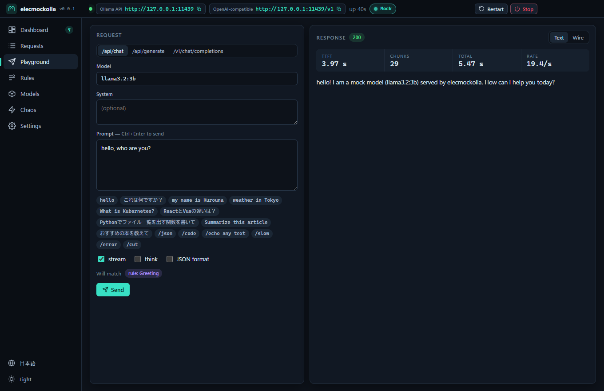
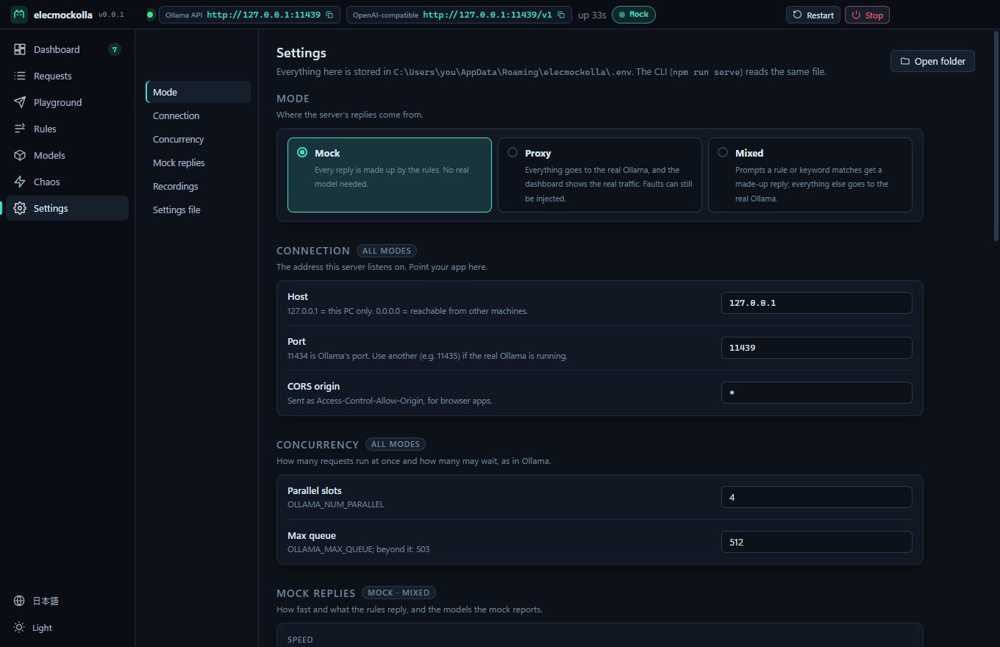

[](https://github.com/kurouna/elecmockolla/actions/workflows/ci.yml)
[](https://github.com/kurouna/elecmockolla/releases)
[](LICENSE)
[](https://zenn.dev/kurouna)
[](https://x.com/elecxzy)


# elecmockolla

A mock [Ollama](https://ollama.com) server with a live dashboard. Point your app at it instead
of a real model, and get instant, scripted, reproducible replies — or record the real Ollama's
replies once and play them back — for tests, for debugging, and for demos without a GPU.

Ollama 互換のダミーサーバーと、その動きを見て操作できる管理画面。本物の LLM を待たずに、
アプリのテストや動作確認ができます。返答はルールで決めた内容をいつも同じように返すほか、
本物の Ollama の返答を保存して再現することもできるので、GPU のない環境でもデモを見せられます。

<p align="center">
  
</p>

> **v0.0.2 — early release.** Developed and used on Windows. The server and CLI are plain Node
> and run anywhere; the macOS and Linux apps are built and tested on GitHub's runners but have
> not been tried by hand yet.

## Install

Download the app from [Releases](https://github.com/kurouna/elecmockolla/releases):

| Platform | File |
| --- | --- |
| Windows x64 / arm64 | `elecmockolla-win-x64-<version>.exe` / `elecmockolla-win-arm64-<version>.exe` (installer), or the `.zip` of the same name (no install) |
| macOS Apple silicon / Intel | `elecmockolla-mac-arm64-<version>.dmg` / `elecmockolla-mac-x64-<version>.dmg` |
| Linux x64 | `elecmockolla-linux-x86_64-<version>.AppImage` or `elecmockolla-linux-amd64-<version>.deb` |
| Linux arm64 | `elecmockolla-linux-arm64-<version>.AppImage` or `elecmockolla-linux-arm64-<version>.deb` |

Start it and the mock is listening on `http://127.0.0.1:11434`, Ollama's own address. Point your
app there (or set `OLLAMA_HOST`). If the real Ollama already uses 11434, the app says so — change
the port in **Settings**.

The Windows builds are the ones the author runs. The macOS and Linux builds come out of the same
release workflow and pass the unit and e2e tests on GitHub's runners, but have had no hands-on
testing: treat them as not sufficiently verified.

リリースページからダウンロードして起動すると、Ollama と同じ `http://127.0.0.1:11434` で待ち受けます。
本物の Ollama が同じ PC で動いている場合は、設定画面でポートを変えてください。

### If a warning appears

The installers are not code-signed: a certificate costs more than a personal project can carry. So
Windows and macOS warn before the first run. The warnings mean the publisher is unknown to them, not
that anything was found in the file. If you want to check a download first, the release page lists
every file's SHA-256 checksum. Each installer is built from the tagged source by the
[release workflow](.github/workflows/release.yml) on GitHub's runners. These steps are needed once
per install.

**Windows**

1. The browser may hold the download back ("isn't commonly downloaded"). In Edge, open the download's
   *⋯* menu → *Keep* → *Show more* → *Keep anyway*. In Chrome, choose *Keep*.
2. Run the `.exe`. SmartScreen shows **"Windows protected your PC"**: click **More info**, then
   **Run anyway**.
3. The installer installs for your user only, so it asks for no administrator rights.

If Windows says the file was blocked and offers no *Run anyway*, right-click the `.exe` →
*Properties* → tick **Unblock** → *OK*, and run it again.

**macOS** (15 Sequoia and later; older versions in the last step)

1. Open the `.dmg` and drag **elecmockolla** into *Applications*.
2. Open elecmockolla from *Applications*. macOS says it **"could not verify 'elecmockolla' is free of
   malware"**: click **Done** (not *Move to Trash*).
3. Open **System Settings → Privacy & Security**, scroll to *Security*, and click **Open Anyway**
   beside the line about elecmockolla. Confirm with your password or Touch ID, then **Open Anyway**
   again.
4. On macOS 14 or earlier, right-click the app → **Open** → **Open** does the same.

If macOS instead says **"elecmockolla is damaged and can't be opened"**, the file is not damaged.
The quarantine mark from the download is what stops it. Remove the mark and open the app again:

```bash
xattr -dr com.apple.quarantine /Applications/elecmockolla.app
```

**Linux** (no warning, but two things to know)

- **deb** (Debian, Ubuntu): `sudo apt install ./elecmockolla-linux-amd64-<version>.deb`. It also
  installs the AppArmor profile that Ubuntu 24.04 and later need before Electron's sandbox can start.
- **AppImage**: `chmod +x elecmockolla-linux-*.AppImage` and run it. It needs FUSE 2 (`libfuse2`, or
  `libfuse2t64` on Ubuntu 24.04). On Ubuntu 24.04 and later it may stop with a message about the
  *SUID sandbox helper*, because AppArmor blocks the sandbox there. Use the deb in that case. Do not
  start it with `--no-sandbox`: the sandbox is what keeps the renderer away from your files.

インストーラーは未署名のため、Windows と macOS は初回起動時に警告を出します。手順は上のとおりです。

## From source

```bash
npm install
npm start
```

The app opens, writes `.env` and `rules.json` next to `package.json` if they do not exist, and
starts the mock. Without the app (Node 22.18+):

```bash
npm run serve                     # same server, same .env, logs every request
npm run serve -- --port 11435 --preset demo
npm run cli -- init               # write .env and rules.json
npm run cli -- check              # validate .env and the rules file
npm run cli -- --help
```

## What makes it different

Other mock servers ([fake-ollama](https://github.com/spoonnotfound/fake-ollama),
[llmock/aimock](https://github.com/CopilotKit/llmock),
[ollamock](https://pkg.go.dev/github.com/thushan/olla/test/cmd/ollamock), MockServer) are
headless. elecmockolla adds what you want while building an app that talks to Ollama:

- **See what your app sends.** Every request is recorded: the exact body, which rule answered,
  queue / load / first-token / streaming time, and a *copy as curl* button. Save the history
  as JSON (every field) or HAR (opens in browser dev tools and HAR viewers).
- **Watch it run.** Tokens per second, busy slots and queue over time, a live card per parallel
  slot, and a waterfall of the last 30 seconds — animated at 60 fps, dark and light.
- **Behaves like Ollama under load.** `OLLAMA_NUM_PARALLEL`-style slots and an
  `OLLAMA_MAX_QUEUE`-style queue: extra requests wait, and past the queue they get
  `503 server busy`. Cold models pay a load time and show up in `/api/ps` until `keep_alive`
  expires.
- **Replies you design, without code.** Regex rules with capture groups (`$1`, `$<name>`), a
  keyword table for the quick cases (`？` → a question reply), lorem ipsum in English or
  Japanese, JSON templates, tool calls and thinking — edited in the app and tested live before
  you save.
- **Chaos on a button.** HTTP 500, a stream cut halfway, a request that never answers, or a
  broken JSON line — once, five times, or at random with a probability. A load generator fills
  the dashboard or the queue.
- **Reproducible.** A fixed seed gives the same reply to the same prompt, every run. Speed
  presets from *Instant* (for CI) to *Slow CPU* (for spinners and timeouts), and *Demo*.
- **Or put the real Ollama behind it.** Proxy mode forwards everything to a real Ollama and
  shows the real traffic on the same dashboard; mixed mode answers from the rules first and
  sends the rest to Ollama. Record the real replies once and play them back without a GPU.

<p align="center">
  
</p>

## API coverage

| Ollama | OpenAI-compatible | Control (`/_mock/*`) |
|---|---|---|
| `POST /api/chat`, `/api/generate` (stream or not, `think`, `format`, `tools`, `num_predict`, `keep_alive`, `seed`) | `POST /v1/chat/completions` (SSE, `stream_options.include_usage`, `response_format`, tool calls) | `GET status`, `requests` (`?format=har` or `json` for a file), `events` (SSE), `recordings` |
| `POST /api/embed`, `/api/embeddings` | `POST /v1/completions` | `GET`/`PUT rules` |
| `GET /api/tags`, `/api/ps`, `/api/version`, `POST /api/show` | `POST /v1/embeddings` (float or base64) | `GET`/`PATCH config` |
| `POST /api/pull` (simulated progress), `/api/create`, `/api/copy`, `DELETE /api/delete` | `GET /v1/models`, `/v1/models/:id` | `POST`/`DELETE fault`, `POST test`, `reset` |

Tested with the official [`ollama`](https://www.npmjs.com/package/ollama) and
[`openai`](https://www.npmjs.com/package/openai) clients. Embeddings are deterministic and
similar texts get similar vectors, so retrieval code can be tested too.

## Replies

Every prompt goes through three stages; the first that matches answers. (With playback on, a
recorded prompt is answered from [Recordings](#recordings) before any of them.)

1. **Rules** — `regex`, `contains` or `always`, on the last user message, the whole
   conversation or the system prompt, optionally only for some models. Each rule chooses a reply
   kind (template, lorem, JSON, tool call, echo), and may override the speed or force a fault.
2. **Keyword table** — "if the prompt contains X, reply Y".
3. **Fallback** — lorem ipsum by default, in Japanese when the prompt is Japanese.

Templates understand `$1`…`$99`, `$<name>`, `$&`, and `{{prompt}}`, `{{model}}`,
`{{lorem:N}}`, `{{lorem-ja:N}}`, `{{int:1-100}}`, `{{pick:a|b|c}}`, `{{calc:$1+$2}}`, `{{uuid}}`, `{{date}}`,
`{{time}}`, `{{now}}`, `{{n}}`. When the client asks for `format: "json"` or a JSON schema and
the rule replied with text, a valid document is produced (fake values that follow the schema).

The default `rules.json` starts with one slash command per feature: `/json`, `/code`,
`/echo …`, `/slow`, `/error`, `/cut`. Then come replies for the conversations an AI chat
usually has, in Japanese and English:

- **Greetings** by the time of day (おはよう, good night…), "I'm home", よろしく, long time no
  see, New Year and Christmas.
- **What people type to test a chat**: `テスト`, `ping`, "reply with just OK", "repeat after
  me", `hoge` / `asdf`, arithmetic (`1+1は？`, `What is 7*6?`), counting to ten, the
  alphabet and あいうえお.
- **What a kindergartner knows**: the color of the sky, apples, snow and a rainbow, traffic
  lights, what animals say, how many legs, days in a week, months in a year, the seasons.
- **Requests**: "what is …", "how do I …", comparisons (as a table), code (TypeScript or
  Python), fixing an error, summaries, translation, rewriting, emails, recommendations, pros
  and cons, ideas, poems, stories, jokes, recipes, the weather, fortune-telling, the date and
  time — and a refusal, to test how your app shows one.
- **Small talk**: thanks, sorry, praise, laughter, boredom, hunger, feeling down, good news,
  birthdays, "are you human?", dice and coins, fun facts, goodbyes.

Try `hello`, `What is Kubernetes?`, `ReactとVueの違いは？`, `東京の天気は？`, `空は何色？`,
`Tell me a joke`. These rules read only the first line of the prompt.

At the end of the list, **off by default**, are rules for the ELEC system pane of
[elecdex](https://github.com/kurouna/elecdex): each of the three units (LOGOS, ETHOS, PATHOS)
gets a statement in its own voice and in the motion's language, ending with the `VERDICT:` and
`CONFIDENCE:` lines elecdex reads. Each unit leans its own way (`{{pick:…}}` chooses the verdict,
`{{int:…}}` the confidence), so the council does not always agree. Turn them on in **Rules**:
search for `elec`, then **Turn these on**.

The tester above the list tries a prompt against the rules being edited, before they are saved,
and marks the rule that answers. The rule list can be searched (name, id, pattern, reply) and
filtered by on / off.

When a newer version brings new or improved built-in rules, the **Rules** page offers them —
**Take them** puts new rules in place among the others and replaces a built-in rule you never
edited with its new version (keeping it on or off); **Don't take** stops offering them. Rules you
wrote or edited are left as they are, and rules you deleted are not brought back (`rules.json`
remembers what it has been offered in `seenDefaults`).

Patterns are JavaScript regular expressions and run as written. A pattern with catastrophic
backtracking (such as `(a+)+$`) can take seconds or longer on some prompts, and while it runs the
tester — or the server, for a real request — does not respond. Keep patterns simple, or anchor
them.

<p align="center">
  
  
</p>

## Proxy and mixed modes

Set the mode in **Settings** (or `MOCKOLLA_MODE`, `--mode`):

| Mode | Replies |
|---|---|
| `mock` (default) | all made up by the rules |
| `proxy` | all from the real Ollama at `MOCKOLLA_UPSTREAM` (default `http://127.0.0.1:11434/v1`) |
| `mixed` | a matching rule or keyword answers; anything that would reach the fallback goes to Ollama — except for a model only the mock has, which the fallback answers |

The server and Ollama cannot share a port, so run this one on another port and point your app
at it:

```bash
npm run serve -- --mode proxy --port 11435
npm run serve -- --mode mixed --port 11435 --upstream http://gpu-box:11434/v1
```

Replies pass through byte for byte; they are read on the way, so every request shows up in the
dashboard and the inspector with its text, tokens per second, and the timings Ollama itself
reports (`load_duration`, `prompt_eval_duration`, `eval_duration`) — the waterfall shows the
real model load and prompt evaluation. The **Models** page lists Ollama's models and what
`/api/ps` says is in memory, with VRAM. Faults still work: inject a disconnect or a broken line
into a real stream. Parallel slots still apply, so set them at least as high as Ollama's
`OLLAMA_NUM_PARALLEL` to watch without throttling (or lower, to try a smaller machine).

プロキシモードでは本物の Ollama にそのまま中継しつつ、通信をダッシュボードに記録します。
混在モードはルールに一致したものだけダミーで返し、残りを Ollama に渡します（モックにしかないモデルは常にモックが返答します）。

## Recordings

Record the real Ollama once, then play its replies back without it — for demos, videos and CI
that need real-looking answers but no GPU.

- **Record** (`MOCKOLLA_RECORD=true`, `--record`, off by default): in proxy and mixed modes,
  every reply Ollama gives is saved to `recordings.json` next to `.env` — the input as it was,
  and the reply as it streamed: its chunks, thinking, tool calls, time to first token and speed.
  The first reply to a prompt is kept.
- **Play back** (`MOCKOLLA_REPLAY=true`, `--replay`, off by default): in mock and mixed modes, a
  recorded prompt gets its recorded reply, chunk for chunk at the recorded speed, before any
  rule. In mixed mode it no longer reaches Ollama. Proxy mode never plays back.
- **Matching** ignores case, full/half width, spaces, punctuation and symbols:
  `Hello, world!` and `hello world` are the same prompt. The model must be the same, and so must
  the whole conversation (system prompt and every message). Replies are returned verbatim —
  `{{...}}` and `$1` in a recording are never expanded.
- The **Recordings** tab of the Rules page lists them, shows each one with its chunk boundaries,
  and deletes them. A red **REC** badge in the title bar shows recording is on.

```bash
npm run serve -- --mode proxy --port 11435 --record   # use your app against the real model
npm run serve -- --replay                              # later: the same answers, no Ollama
```

本物の Ollama の返答を `recordings.json` に録画し、あとでモックがそのまま再生します。
照合では大文字小文字・全角半角・空白・句読点・記号を無視します。

## Settings

Everything lives in `.env` (see [.env.example](.env.example)); the app edits the same file the
CLI reads. Precedence: defaults < `.env` < `MOCKOLLA_*` environment variables < CLI options.
`OLLAMA_HOST`, `OLLAMA_NUM_PARALLEL` and `OLLAMA_MAX_QUEUE` are understood inside `.env`, but
ignored from the environment, so a machine that runs the real Ollama does not move the mock.

| Variable | Default | |
|---|---|---|
| `MOCKOLLA_HOST` / `MOCKOLLA_PORT` | `127.0.0.1` / `11434` | where to listen |
| `MOCKOLLA_NUM_PARALLEL` / `MOCKOLLA_MAX_QUEUE` | `4` / `512` | slots and queue |
| `MOCKOLLA_TTFT_MS` / `MOCKOLLA_TPS` / `MOCKOLLA_JITTER` | `350` / `30` / `0.2` | speed (`TPS=0`: no delay) |
| `MOCKOLLA_LOAD_MS` / `MOCKOLLA_KEEP_ALIVE` | `1200` / `300` | cold model load, seconds loaded |
| `MOCKOLLA_SEED` | empty | fixed seed for reproducible replies |
| `MOCKOLLA_CORS` | `*` | `Access-Control-Allow-Origin`, for browser apps; empty = no CORS |
| `MOCKOLLA_MODELS` / `MOCKOLLA_STRICT_MODELS` | 5 models / `false` | model list; strict = 404 for others |
| `MOCKOLLA_EMBED_DIM` / `MOCKOLLA_PULL_MS` | `768` / `4000` | embedding length, simulated `/api/pull` time |
| `MOCKOLLA_VERSION` | `0.12.0` | what `/api/version` reports |
| `MOCKOLLA_FAULT_RATE` / `MOCKOLLA_FAULT_MODE` | `0` / `random` | random fault injection |
| `MOCKOLLA_RULES` | `rules.json` | rules file, relative to `.env` |
| `MOCKOLLA_MODE` / `MOCKOLLA_UPSTREAM` | `mock` / `http://127.0.0.1:11434/v1` | proxy and mixed modes, the real Ollama (its OpenAI URL; `/api/...` goes to the same server) |
| `MOCKOLLA_RECORD` / `MOCKOLLA_REPLAY` | `false` / `false` | record Ollama's replies, play them back |
| `MOCKOLLA_RECORDINGS` | `recordings.json` | recordings file, relative to `.env` |

`npm start` and `npm run serve` use the `.env` in the project folder. The installed app keeps
`.env`, `rules.json` and `recordings.json` in its user data folder (`%APPDATA%\elecmockolla` on
Windows, `~/Library/Application Support/elecmockolla` on macOS, `~/.config/elecmockolla` on
Linux); **Settings → Open folder** opens it. `MOCKOLLA_HOME` overrides the folder in both cases.

The app speaks English and Japanese: Japanese when the OS language is Japanese, English
otherwise. Switch it at the bottom of the sidebar, or start with `MOCKOLLA_LANG=en|ja`. The
theme (dark or light) is switched there too, and **Ctrl+1** … **Ctrl+7** open the pages.

<p align="center">
  
</p>

画面は日本語と英語に対応しています（OS の言語が日本語なら日本語）。サイドバー下部で切り替えられます。

## Using it in tests

```ts
import { MockServer } from './src/core/server.ts'
import { defaultConfig, applyPreset, presetById } from './src/core/config.ts'
import { defaultRules } from './src/core/rules.ts'

const server = new MockServer({
  config: { ...applyPreset(defaultConfig(), presetById('instant')!), port: 0 },
  rules: defaultRules(),
})
const url = await server.start()   // http://127.0.0.1:<free port>
server.injectFault('disconnect')   // the next request is cut mid-stream
await server.stop()
```

Or run the CLI with `--preset instant --port 0 --json` and drive it through `/_mock/*`:

```bash
curl -X PATCH http://127.0.0.1:11434/_mock/config -H 'Content-Type: application/json' -d '{"tps": 0}'
curl http://127.0.0.1:11434/_mock/requests?format=har -o requests.har
```

The control API answers this machine only (loopback, addressed as `localhost` / `127.0.0.1`),
takes bodies only as `application/json`, and sends no CORS headers — so neither another machine
on the network nor a web page open in the browser can reconfigure the server, even with host
`0.0.0.0`. In the app, changes made through it are saved to `.env` / `rules.json` and shown in
the UI.

## Development

```bash
npm run verify        # biome + typecheck + vitest
npm run build         # production bundle into out/
npm run test:e2e      # build first; Playwright drives the app
npm run gen:icon      # build/icon.svg -> the PNG icons
npm run package       # installers into release/
```

`src/core` is the server, dependency-free and run directly by Node's type stripping (Node
22.18+). `src/main` runs it in an Electron utility process, `src/renderer` is the Svelte 5 UI.
The renderer is sandboxed and has no network: the playground and the load generator run in
main. See [CLAUDE.md](CLAUDE.md) for the layout and the rules.

### Releasing

1. Set `version` in `package.json`, commit, and push.
2. Tag that commit `v<version>` and push the tag: `git tag v0.1.0 && git push origin v0.1.0`.
3. The [Release workflow](.github/workflows/release.yml) checks the tag against `package.json`,
   runs `npm run verify`, creates a GitHub pre-release whose notes start with the unsigned-build
   instructions (English and Japanese) followed by the generated changes, and attaches the builds
   for Windows (x64, arm64; installer and zip), macOS (arm64, x64) and Linux (AppImage and deb,
   x64 and arm64).
4. Review the pre-release and, when it is ready, untick "Set as a pre-release".

[CI](.github/workflows/ci.yml) runs lint, typecheck, the unit tests and the e2e tests (Windows,
macOS, Linux) on every push to `main` and every pull request, and packages the app for each OS.

## License

MIT. Not affiliated with Ollama.
